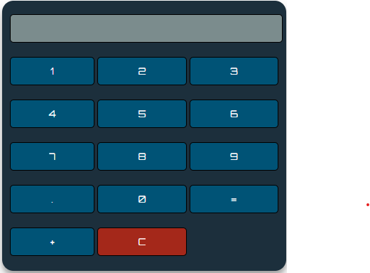

# Calculator
<strong>Created Sum Calculator using CSS, HTML and JavaScript </strong>

The calculator consists of the following components:

Mathematical Operators: Addition (+)
<li>Digits and Decimal Button: 0, 1, 2, 3, 4, 5, 6, 7, 8, 9, . .</li>
<li>Display Screen: It displays the mathematical expression and the result.</li>
<li>Clear Screen Button: It clear all mathematical values.</li>
<li>Calculate button (=): It evaluates the mathematical expression and returns the result.</li>

